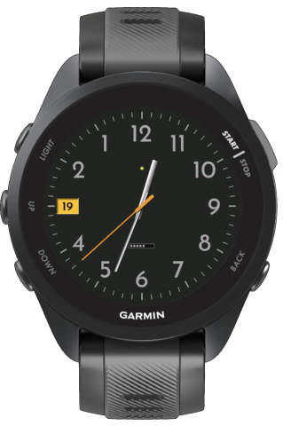

# Counterclock

An analog watch face for Garmin watches, written in Monkey C (Connect IQ), in which time runs **backwards**: the numbers are laid out counterclockwise and the hands sweep counterclockwise. 12 stays at the top and 6 at the bottom, and the hands still point at the right number.

Built as a personal watch face for the Forerunner 570 (42mm). It is sideloaded rather than published to the Connect IQ Store.



## Features

- Mirrored dial, styled after a Bauhaus-style German watch face on a dark grey background with an amber date box: a minute track with longer, thicker five-minute marks, and Josefin Sans numerals for every hour except the date's. It is mirrored, so the numerals and all three hands run counterclockwise.
- Hour and minute hands are shaded across their width so they look slightly rounded. The hour hand is wider than the minute hand, so it still shows from behind when they overlap.
- Red second hand with a thick hub and a thin needle. It is hidden in low-power mode.
- Soft drop shadows under all hands. Stacking order is hour, minute, second.
- Day of the month in an inset panel on the left, at the hour-3 position.
- Tiny unread-notification dot above the center, drawn only when there is a notification.
- Tiny battery gauge below the center: eight dots in a frame, each an eighth of the charge. The dots turn yellow at 25% or below, orange at 20% or below and red at 10% or below.
- One on-device setting: a background slider from jet black to 50% grey.

## Requirements

- [Connect IQ SDK](https://developer.garmin.com/connect-iq/sdk/) (developed against 9.2.0)
- Visual Studio Code with the Garmin Monkey C extension (or the SDK command line)
- A Connect IQ developer key

The target device is set in `manifest.xml` (`fr57042mm`). Add more `<iq:product>` entries to support other watches. Colors and layout are proportional to the screen size, but only the Forerunner 570 42mm has been tested.

## Build and run

In VS Code, run **Monkey C: Build Current Project** or press F5 to launch the simulator. From the command line:

```sh
monkeyc -f monkey.jungle -o bin/Counterclock.prg -y /path/to/developer_key -d fr57042mm -w
```

Keep your developer key outside the repository.

## Install on a watch

1. Build a `.prg` for the target device (above).
2. Connect the watch by USB. The Forerunner 570 uses MTP, so it does not mount as a drive on macOS. Use Windows, or an MTP tool such as [OpenMTP](https://openmtp.ganeshrvel.com/), and quit Garmin Express first.
3. Copy `Counterclock.prg` to `GARMIN/APPS/` on the watch and eject.
4. Choose Counterclock from the watch's watch-face menu.

## Settings

The background is set on the watch, not in Garmin Connect. Open the watch face's settings and drag the slider (or use the up and down buttons; Enter or Back leaves the screen). The screen shows the chosen color as you adjust, and the value is saved when you leave, using `Application.Storage`. The default is dark grey (20%).

Garmin Connect Mobile only shows `settings.xml` app settings for apps that are registered with the Connect IQ Store, so a sideloaded face can't use them.

## Project layout

```
manifest.xml                 App id, target devices, permissions
monkey.jungle                Build configuration
source/CounterclockApp.mc    App entry point, settings entry point
source/CounterclockView.mc   All drawing: dial, date, hands, indicators
source/CounterclockBackground.mc  Clears the screen to the background color
source/CounterclockSettings.mc    Background storage and settings slider
resources/                   Strings, layout, launcher icon, fonts
tools/make_bitmap_font.py    Generates the bitmap fonts from a TTF
docs/AGENTS.md               Notes for future development
```

## License

Licensed under the [GNU General Public License v3.0](LICENSE).

The bitmap fonts in `resources/fonts/` are derived from [Josefin Sans](https://github.com/ThomasJockin/JosefinSansFont-master), licensed under the SIL Open Font License 1.1 (`resources/fonts/OFL.txt`).

## Limitations

- Watch faces can update at most once per second while awake (once a minute in low-power mode), so the second hand ticks rather than sweeps. This is a platform limit.
- The numerals and date use bitmap fonts made from Josefin Sans, so they are fixed at one pixel size. `tools/make_bitmap_font.py` regenerates them.
